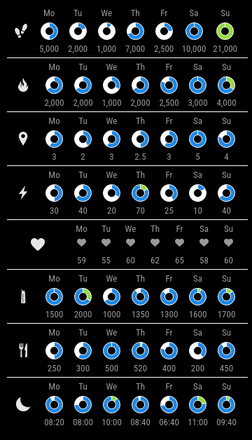

# MMM-Fitbit2-ext

Read and display fitbit data for the last week.

### _Current Status: in Development_

(_Work to be done on MMM-Fitbit2 is identified and tracked [here](https://github.com/m-roberts/MMM-Fitbit2/projects)_)

### Description

[MagicMirror](https://github.com/MichMich/MagicMirror) Module for displaying Fitbit data, retrieved from Fitbit API ([https://api.fitbit.com](https://dev.fitbit.com/build/reference/web-api/)).

 #TODO

**Note: this module requires that you set up your own "Fitbit app" using a free Fitbit account. It's not a big deal, it's just a container for your credentials and where to put all the vital information about what your app is or does. You can't access your data from Fitbit without it.**

### About This Module

This module reads and displays fitbit data for the past seven days. It extends [MMM-fitbit2](https://github.com/m-roberts/MMM-Fitbit2) by Mike Roberts, which in turn extends SVendittelli's original [MMM-fitbit](https://github.com/SVendittelli/MMM-fitbit) module. [MMM-fitbit2](https://github.com/SVendittelli/MMM-fitbit) built on top of the following changes that were incorporated from the efforts of others who forked the original repository:

- adding weight data ([engeld's fork](https://github.com/engeld/MMM-fitbit))
- automatic re-authorisation when tokens have expired ([shbatm's fork](https://github.com/shbatm/MMM-fitbit))

## Supported Data

- Steps Walked (compared to goal)
- Calories Burned (compared to goal)
- Total Distance Walked (compared to goal)
- \# of Active Minutes (compared to goal)
- Today's Remaining Water Intake (compared to goal)
- Today's Remaining Calories To Consume (compared to goal)
- Sleep Time (compared to goal)
- Resting Heart Rate (average for the day)

## Dependencies

These will be automatically installed during the Installation process described below.

### Node.js

- [python-shell](https://www.npmjs.com/package/python-shell/v/0.5.0)
- [chart.js](https://www.chartjs.org/docs/latest/)

### Python 3

- [python-fitbit](https://pypi.org/project/fitbit/0.3.1)

## Setup

- Go to [Fitbit](https://dev.fitbit.com/apps/new/) and register a new app (sign in with your Fitbit account if needed).
  - Give your app a catchy name and description
  - Your personal website, organisation, and organisation website can be whatever you like
  - Ensure that `OAuth 2.0 Application Type` is set to "Personal"
    - (If you're asked for `OAuth 1.0 Application Type (Deprecated)`, set to "Browser")
  - Callback URL **MUST BE** `http://127.0.0.1:8888/`
  - Give your app read-only permission
  - Note your OAuth 2.0 credentials (you'll need them during setup)
    - "OAuth 2.0 Client ID" --- (this is your `clientId`)
    - "Client (Consumer) Secret" --- (this is your `clientSecret`)
      - You can access these again later via [Manage My Apps](https://dev.fitbit.com/apps)

## Installation

### Setting up a virtual python environment

When using Raspberry Pi OS bookworm and newer you need to use a virtual environment for running Python, otherwise you might encounter the message `error: externally-managed-environment`.

To setup the environment run `python3 -m venv mmenv` (you can use any name instead of mmenv) and activate it with `source mmenv/bin/activate`. The easiest option is to run it in the root folder (`~/`), but you can also use other directories. You can now do the following installation steps within the virtual environment. To exit the environment, simply run `deactivate`.

After the installation the environment doesn't need to be active for the module to function. For this you have to set `pythonPath` within `config.js` of this module to the python path of your virtual environment. In this example, it would be:

```javascript
{
	module: "MMM-Fitbit2-ext",
	config: {
		pythonPath: "/home/medicalmirror/mmenv/bin/python3"
	...
	}
},
```

### Installation Steps

```bash
cd ~/MagicMirror 	# or whatever your path to Magic Mirror is

cd modules

git clone https://github.com/SandraPrestel/MMM-Fitbit2-ext

cd MMM-Fitbit2

# Install dependencies
./init.sh

# Repeat for each user/module instance
./auth.sh
```

### `auth.sh`

When you run `auth.sh`, you'll be asked to provide your personal `clientId` and `clientSecret` information.

After this, a web browser will launch on your display (even if you ran `auth.sh` over SSH). You'll need to log in using your Fitbit username and password, if you are not logged in already. Make sure to allow access to all options and close the window when instructed.

Once you have done this, you should have a file called `python/tokens-<clientId>.json`. If you have this, you have finished authorisation!

### Some notes on how tokens work, and how to use them properly

Generating tokens for any Fitbit application will nullify all previously generated tokens associated with a given `clientId` for that application.

Copying tokens from one machine to another will only work until one of the machines refreshes the tokens (typically in 24 hours), whereby the outdated tokens on the other machine will now be unable to refresh themselves, leading to an invalid grant error.

Therefore, if you want to have your Fitbit account working with MMM-Fitbit2 on more than one device (such as a development machine), you should create a new Fitbit application for each usage.

## Configuration

After installing MMM-Fitbit2, you will need to include the module in your MagicMirror configuration.

Add the example config below to your config file in `~/MagicMirror/config/config.json` (or whatever your path to your Magic Mirror config is), making sure to swap out `clientId` and `clientSecret` with your own.

```javascript
		{
			module: "MMM-Fitbit2-ext",
			position: "top_center",
			config: {
				credentials: {
					clientId: "",
					clientSecret: ""
				},
				resources: [
					"steps",
					"distance",
					"activeMinutes",
					"caloriesOut",
					"caloriesIn",
					"water",
					"restingHeart",
					"sleep"
				],
				pythonPath: "python3",
				updateInterval: 30,
				showLastSynced: false,
				debug: false,
				test: false
			}
		},

```

**Finally, (re)start your MagicMirror!**

## Configuration Options

| **Option**       | **Default** | **Description**                                                                                                                               |
| ---------------- | ----------- | --------------------------------------------------------------------------------------------------------------------------------------------- |
| `credentials`    | see above   | ClientId and Secret configured in the previous steps                                                                                          |
| `resources`      | see above   | Data to be displayed <br>Possible values: `steps`, `caloriesOut`, `distance`, `activeMinutes`, `restingHeart`, `water`, `caloriesIn`, `sleep` |
| `pythonPath`     | see above   | Path to Python executable when using a virtual environment                                                                                    |
| `updateInterval` | see above   | How often the data is refreshed in minutes (see following note about API tokens)                                                              |
| `showLastSynced` | see above   | Display the time of the last data refresh (`true` or `false`)                                                                                 |
| `debug`          | see above   | see below unter "Troubleshooting"                                                                                                             |
| `test`           | see above   | see below unter "Troubleshooting"                                                                                                             |

### Notice

The Fitbit API explains:

> You can make 150 API requests per hour for each user that has authorized your application to access their data. This rate limit is applied when you make an API request using the user's access token.

The default configuration is designed to fetch new Fitbit data every 10 minutes. Depending on the number of resources that are selected, it is likely that multiple API requests are made each time that new Fitbit data is fetched.

This must not be done too often otherwise the rate limit will be exceeded, and Fitbit will not send new tokens and an uncaught exception will be thrown. It is not recommended that a value of less than 10 be used, unless fewer resources are selected. Try setting this to a higher number if you are experiencing problems.

## Files

### .json (generated)

- `tokens-<clientId>.json` - Access token data generated by OAuth 2.0 credentials. Used to retrieve data from Fitbit API. A new file is generated for each client ID.

### Python (internal)

- `json_handler.py` - Handles JSON, including reading and writing token files.
- `setup_access.py` - Used by `auth.sh` to generate token `.json` files.
- `get_data.py` - Uses `python-fitbit` Python library to get Fitbit API data, using credentials from `tokens-<clientId>.json`. Client credentials and data to fetch is passed in via command line parameters. The response is printed out in JSON format, to be parsed by `node_helper.js`.
- `test_data.py` - Generates test data if `test` is set to `true`

### Javascript (used by MagicMirror)

- `node_helper.js` - Calls `get_data.py` or `test_data.py`, passes it to `MMM-Fitbit2-ext.js`.
- `MMM-Fitbit2-ext.js` - Receives data from `node_helper.js` and injects it into DOM.

### CSS

- `MMM-Fitbit2-ext.css` - Styling.

## Troubleshooting

### General help

For more information in the logs, add `debug: true` to your module config, and restart MagicMirror.

If you are being rate-limited, or do not have a Fitbit account, you can add `test: true` to return dummy data. This can be helpful for development.

### Invalid refresh token

If you are getting `oauthlib.oauth2.rfc6749.errors.InvalidGrantError: (invalid_grant)` when running `get_data.py`, it likely means that your access token has expired and your refresh token is not the latest one associated with your account. Try running `setup_access.py` again, and seeing if this helps.

## Uninstalling/Revoking Access

There are a few ways that you can do this:

### You have access to the device and want to keep your Fitbit application

Simply delete your tokens file (`tokens-<clientId>.json`) from `python/`.

### You do not have access to the device and want to keep your Fitbit application

Simply generate new tokens for yourself on another machine. This will make your previous tokens invalid.

### You do not want to keep your Fitbit application (a.k.a. "reset all permissions")

Go to [Manage My Apps](https://dev.fitbit.com/apps), log in if necessary, select your app and then "Delete Application".
